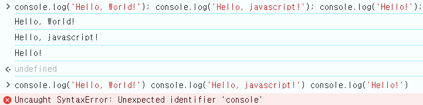

# 1. 코드 작성 규칙

## 세미콜론

> 하나의 명령어 뒤에는 세미콜론 붙이기.

```javascript
console.log('Hello, World!');
```

특히 한 줄에 여러 명령을 넣을 땐 반드시 각 명령 뒤에 세미콜론을 넣어 구분해줘야 한다.

```javascript
console.log('Hello, World!');
console.log('Hello, javascript!');
console.log('Hello!');
```

-> 세미콜론 없으면 에러 발생.



<br>

## 주석

> 한 줄 주석

```javascript
// Hello, comment! 출력
console.log('Hello, comment!');
```

<br>

> 여러 줄 주석

```javascript
/* console.log('Hello, World!');
console.log('Hello, comment!'); */
```

<br>

> 코드 중간 주석

```javascript
console.log('Hello, World!');
/* 여러 줄 
주석
입니다 */ console.log('Hello, comment!');
```

<br>

## 들여쓰기

자바스크립트는 들여쓰기에 제한이 없음. 하지만 통일하는 게 좋음. 주로 2칸.
