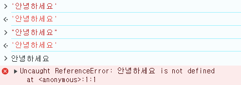
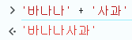

# 2. 자료형

## 1) 문자열

> 반드시 따옴표로 감싸줘야 함.

작은 따옴표(''), 큰 따옴표("") 둘 다 가능. 백틱(``)도 가능.

안 감싸면 에러 발생.



따옴표 짝 안맞춰도 에러 발생.


<br>

> 백틱

다른 따옴표는 Enter 시 실행인 것과 달리 백틱은 Enter 시 줄바꿈.


<br>

> typeof 연산자

자료형 반환.


<br>

> 문자열 연산자

- `+`: 문자열끼리 더하기

  

- `-`: 문자열끼리 빼기

  

- 그 외 곱하기`*`, 나누기`/`, 나머지`%`등등 다 됨.

  

  - NaN: Not a Number. 숫자가 아니라는 뜻이지만 typeof 해보면 자료형은 number이다.

<br>

## 2) 숫자

따옴표로 감싸지 않고 그대로 적음.

> 지수표기법 (exponential notation)

: 매우 큰 숫자나 소수점 아래 자릿수가 많을 때 숫자를 표현하는 방식. <br>
e 뒤에 나오는 숫자만큼 10의 거듭제곱을 하면 원래 숫자가 됨.

```javascript
5e4; // 5 * 10000 = 50000
5e4; // 5 * 10000 = 50000
5e-3; // 5 * (1/1000) = 0.005
```

<br>

> 2진법, 16진법 등

```javascript
0b111; //2진법(앞에 0b), 7
0111; //8진법(앞에 0), 73
0x1a1; //16진법(앞에 0x), 417
```

<br>

> 문자열을 숫자로 바꾸기

- `parseInt()`: 문자열을 정수로만 변환. 정수가 아닌 값을 입력하면 정수 부분만 추출함.

  ```javascript
  parseInt('124'); //124

  typeof parseInt('124'); //"number"

  parseInt('3.14'); //3
  ```

- `parseFloat()`: 문자열을 소수로 변환.

  ```javascript
  parseFloat('3.14'); //3.14
  ```

- `Number()`: 문자열을 정수 / 소수로 변환.

  ```javascript
  Number('124'); //124

  Number('3.14'); //3.14
  ```

  - `parseInt/parseFloat`와 `Number`의 차이점:

  ```javascript
  parseInt('3월'); //3 -> 해석할 수 있는 최대한을 해석해줌.

  Number('3월'); //NaN -> 숫자 아니면 아예 해석 안 함.
  ```

  <br>

> `prompt`: 입력받기

```javascript
prompt(); //값을 입력받는 대화창이 뜨면 어떤 값이든 입력.

parseInt(prompt());
typeof parseInt(prompt()); //다양하게 조합 가능.
```

<br>

> 다른 기수법 적용하기

parseInt는 문자열을 숫자로 바꿀 때도 사용하지만, 다른 기수법을 적용할 때도 사용됨.
해석하려는 값 뒤에 적용하려는 기수법을 의미하는 숫자를 콤마로 구분해 적어주면 됨.

```javascript
parseInt(111, 2); //7 -> 111을 2진법으로 해석해라. (1*4 + 1*2 + 1 = 7)
parseInt(111, 7); //57 -> 111을 7진법으로 해석해라. (1*49 + 1*7 + 1 = 57)
parseInt(111, 10); //111 -> 111을 10진법으로 해석해라. parseInt(111)과 동일.
```

<br>

> 숫자 연산자

더하기`+`, 빼기`-`, 곱하기`*`, 나누기`/`, 나머지`%`, 거듭제곱`**`

```javascript
1 + 2; //3
6 - 10; //-4
3 * 4; //12
6 / 4; //1.5
6 % 4; //2
2 ** 4; //16
```

<br>

> 자바스크립트에서는 무한이라는 수를 표현하는 Infinity 값 존재.

- 숫자를 0으로 나누면 Infinity.

  ```javascript
  2 / 0; //Infinity
  typeof Infinity; //"number"
  ```

- 음수로도 존재.

  ```js
  -2 / 0; //-Infinity
  ```

- 무한을 나타내는 값이므로 사칙연산을 하더라도 결과는 Infinity.

  ```js
  Infinity - 100; //Inifnity
  ```

- 단, 무한한 값끼리 계산할 땐 다름.
  `js
Infinity - Infinity; //NaN
`
  무한에서 무한을 빼는 것은 성립하지 않는다는 뜻에서 결과값으로 NaN이 나옴.
  <br>
  <br>

> 문자와 숫자 연산

- 형 변환(type casting): 값의 자료형을 바꾸는 것.

- 문자와 숫자 더하기
  <br>
  : 문자가 아닌 애들이 문자열이 됨.

  ```js
  '문자열' + 0; //"문자열0"
  ```

- 문자와 숫자 빼기
  <br>
  : 숫자가 아닌 애들이 숫자가 됨.

  ```js
  '문자열' - 0; //NaN -> '문자열'을 숫자로 바꾸면 NaN.
  '3' - 0; //3

  '3월' - 0; //NaN
  Number('3월') - 0; //NaN -> Number('3월')은 NaN.
  parseInt('3월') - 0; //3 -> parseInt('3월')은 3.
  ```

  <br>

> 연산자 우선순위

- 자바스크립트도 수학의 연산자 우선순위를 따름.

  ```js
  2 + 3 * 4; //14 -> 곱하기 먼저.
  ```

- 연산자 우선순위를 바꿀 때는 소괄호 사용.
  소괄호도 연산자.

  ```js
  (2 + 3) * 4; //20
  ```

  ※ 자바스크립트에서 중괄호({})나 대괄호([])는 수학과는 다른 의미이기 때문에 연산자 우선순위를 바꿀 때는 사용하지 않음.

<br>

> 부동소수점 문제

컴퓨터가 사용하는 2진법으로 실수를 표현하면 무한 반복되는 실수가 있어서 어쩔 수 없이 근사값으로 저장. 그래서 우리가 사용하는 10진법과 차이가 발생하는 경우가 생김.

```js
0.1 + 0.2; //0.30000000000000004
0.3 - 0.1; //0.19999999999999998
```

이외에도 다양한 실수 연산에서 오차가 발생하므로 실수를 계산할 때는 다른 방법을 주로 사용함.

가장 간단한 방법은 실수를 정수로 바꿔서 계산한 뒤, 마지막에 다시 실수로 바꾸는 것.

```js
(0.3 * 10 - 0.1 * 10) / 10; //0.2
```

<br>

## 3) 불 값

> 불 값 표현하기

불린(boolean) 자료형: true와 false를 나타냄. (따옴표로 감싸지 않음)

```js
true;
false;

typeof true; //"boolean"
```

<br>

> 비교 연산자 사용하기

- 참과 거짓은 논리식의 결과값으로 주로 사용됨.

  ```js
  5 > 3; //true -> 숫자 비교
  ```

  <br>

- 비교 연산자 종류
  `>`, `<`, `>=`, `<=`, `==`, `!=`

<br>

- NaN끼리 비교하기

  : NaN끼리 비교할 때는 false 값을 가진다.

  ```js
  NaN == NaN; //false
  NaN <= NaN; //false
  NaN >= NaN; //false
  ```

  다만 `!=` 연산에서는 true 출력.

  ```js
  NaN != NaN; //true
  ```

<br>

- 불 값끼리 비교하기

  : true는 숫자로 변환하면 1이고, false는 숫자로 변환하면 0이다.

  ```js
  true > false; //true
  ```

<br>

- 문자열끼리 비교하기

  문자의 번호를 따름. 첫 문자가 같은 글자일 때는 첫 문자를 빼고 나머지를 다시 비교.

  ```js
  'b' > 'a'; //true -> b(98)가 a(97)보다 문자 번호가 큼.
  'ad' > 'ab'; //true -> 첫 문자인 a가 서로 같으므로 다음 문자를 비교. b(98)와 d(100) 중에 d가 값이 더 큼.
  'ab' > 'a'; //true -> 긴 게 더 큼 (사전 순)
  ```

  - 특수문자도 다 비교 가능.

  - 문자열의 번호를 확인하려면

    ```js
    'a'.charCodeAt(); //97
    '&'.charCodeAt(); //65286
    ```

<br>

- 다른 자료형끼리 비교하기

  다른 자료형이 모두 숫자로 형 변환된 후 비교함.

  ```js
  '3' < 5; //true -> 문자열 3은 숫자 3이 되어 5보다 작다는 것이 성립됨.
  'abc' < 5; //false -> 문자열 abc를 숫자로 바꾸면 NaN이 됨. NaN과의 비교는 false.
  '0' < true; //true -> 문자열 0도 숫자 0으로 형 변환되고, true도 숫자 1로 형 변환됨.
  ```

<br>

- 자료형까지 같은지 비교하는 연산자: `===`

  - `==`는 값만 비교, `===`는 값과 자료형까지 비교.

    ```js
    '1' == 1; //true
    1 == true; //true
    1 == '1'; //true

    '1' === 1; //false
    1 === true; //false
    1 === '1'; //false
    ```

  - `!=`는 값만 비교, `!==`는 값과 자료형까지 비교.

    ````js
    1 != '1'; //false

        1 !== '1'; //true
        ```
    ````

<br>

> 논리 연산자 사용하기

"다음 문장이 참인지 거짓인지 고르시오"에 해당하는 문제.

- `&&`: '그리고'. 좌측 식과 우측 식 모두 true여야 true.

  "10은 5보다 크고 (그리고), 6은 8보다 작다"를 자바스크립트로 표현하면

  ```js
  10 < 5 && 6 < 8; //true -> true && true
  ```

  ※ 비교 연산자가 논리 연산자보다 우선순위가 더 높음. 따라서 괄호는 필요하지 않음.

- `||`: '또는'. 좌측 식이나 우측 식 둘 중 하나만 true면 true.
  ```js
  10 < 5 || 6 < 8; //true -> false || true
  10 < 5 || 6 > 8; //false -> false || fasle
  ```

<br>

> 형 변환 연산자

- `!`: 참을 거짓으로, 거짓을 참으로 만들어주는 연산자.

  ```js
  !true; //false
  !false; //true
  ```

- `!!`: 다른 자료형을 불 값으로 형 변환.
  <br>
  두 번 연달아 썼기 때문에 참인 값은 참 -> 거짓 -> 참으로 변환, 거짓인 값은 거짓 -> 참 -> 거짓으로 변환됨.

  ```js
  !!'a'; //true
  ```

  - 이렇게 문자열이나 숫자를 불 값으로 바꾸면 어떤 값을 갖는지 알아내는 방법은 2가지가 있다. 하나는 `!!`를 앞에 붙이는 것이고, 다른 하나는 `Boolean()`으로 감싸는 것이다.

  - 대부분의 값은 불 값으로 형 변환했을 때 false가 되는 소수의 경우를 제외하면 대부분 true가 된다.

    false가 되는 경우는 false, ''(빈 문자열), 0, NaN, undefined, null. 이들을 거짓인 값(falsy value)라고 하고, true가 되는 값들을 참인 값(truthy value)라고 한다.

    ```js
    !!false; //false
    !!''; //false
    !!0; //fasle
    !!NaN; //false
    ```

- `!` 연산자의 우선순위가 `<` 연산자보다 높음.
  ```js
  !(2 < 0); //true -> 2 < 0은 false, 따라서 최종 값은 true.
  !2 < 0; //false -> 2는 true, !2는 false, 0은 false. false < false는 거짓인 false.
  ```

<br>

> ※ Quiz

숫자와 불 값에서 배운 것을 활용해 다음 연산의 결과가 true가 되게 만들어보기. 연산자만 추가하거나 수정할 수 있다. 정답이 여러 개이다.

```js
5 + 4 * 3 === 27;
```

정답:

```js
!(5 + 4 * 3 === 27);
(5 + 4) * 3 === 27;
5 + 4 * 3 !== 27;
5 + 4 * 3 <> 27;
```

이 외에도 여러 정답이 있음.

<br>

## 4) 빈 값 사용하기

문자열, 숫자, 불 값 자료형 외에도 네 가지(undefined, null, object, symbol)
<br>가 더 있음. 그 중 undefined과 null 자료형은 빈 값 (비어있음)을 표현함.

> undefined

- `console.log` 사용 시 나타나는 것.
  

  반환할 값이 없다는 뜻.

  콘솔에 무언가를 출력하지만, 그 자체로는 결과값이 없기 때문에 undefined가 반환됨.

  - 자료형 확인하면

  ```js
  typeof undefined; // "undefined"
  ```

- undefined는 불 값으로 형 변환했을 때 false가 나옴.

  ```js
  !!undefined; //false
  ```

  - 단, undefined와 false가 같지는않다. 다른 거짓인 값들과도 마찬가지.
    `js
undefined == false; //fasle
undefined == 0; //fasle
undefined == ''; //false
`
    <br>

> null

undefined처럼 빈 값을 의미하지만 같지는 않음.

의도적으로 빈 값을 넣을 때 많이 사용됨.

- null과 undefined 비교
  ```js
  undefined == null; //true -> 값은 빈 값으로 같음.
  undefined === null; //false -> 자료형은 다름.
  ```
- null도 undefined과 마찬가지로 불 값으로 형 변환할 때 false가 됨.
  ```js
  !!null; //false
  ```
  - 단, null과 false가 같지는않다. 다른 거짓인 값들과도 마찬가지.
    ```js
    null == false; //fasle
    null == 0; //fasle
    null == ''; //false
    ```
- null의 자료형을 `typeof`로 확인했을 때 특이점: `"object"`로 나옴.

  ```js
  typeof null; //"object"
  ```

  이 현상은 자바스크립트에서 유명한 버그. 원래는 `"null"`이 나와야 하지만, 언어가 만들어진 초창기 실수 때문에 `"object"`가 됨.

  따라서 값이 null인지 확인하기 위해서는 `===null`을 사용해야 함.

<br>

## 5) 변수

값을 저장할 때 사용.

변수를 만드는 행위를 '선언(declaration)'이라고 한다.

변수를 선언함과 동시에 값을 대입하는 행위를 '초기화(initialization)'라고 한다.

변수 선언은 항상 결과값이 undefined로 출력된다.

변수를 선언하는 방법 3가지: `let`, `const`, `var`

`const`와 `var`은 뒤에 '상수 만들기' 참고.

> let

- 변수를 만드는 형식

  ```js
  let 변수명 = 식;
  ```

- eg. 더하기 연산자의 결과인 32000을 total이라는 이름으로 저장.
  ```js
  let total = 5000 + 8000 + 10000 + 9000; //undefined
  ```
  콘솔에 total을 입력하면 저장된 32000이 출력됨.
  ```js
  total; //32000
  ```

<br>

> 변수명 짓기

- 변수 선언 시 변수에 값을 대입하지 않아도 됨.
  <br>값을 대입하지 않은 변수를 입력하면 `undefined`가 출력됨. (`undefined`가 기본값.)

  ```js
  let empty; //undefined
  empty; //undefined
  ```

- 변수명이 겹치지 않도록 주의하기: 이미 선언한 변수를 다시 선언하면 에러 발생.

  ```js
  let emtpy;
  let empty; //Uncaught SyntaxError; Identifier 'empty' has already been declared.
  ```

- 변수명 제약 사항: - 특수문자는 `$`와 `_`만 사용. - 한글, 한자, 유니코드 사용 가능. - 숫자로 시작하기 불가능. - 중간에 띄어쓰기 불가능. - 대문자로 시작하기 가능하지만 권장x. - **예약어**. 자바스크립트 프로그래밍을 할 때 각각 특정한 역할을 하기 때문에 변수명으로 쓰지 않음.
  `js
let let = 'No!'; //Uncaught SyntaxError: let is disallowed as a lexically bound name.
let var = 'No!'; //VM205:1 Uncaught SyntaxError: Unexpected token 'var'.
`

<br>

> 변수 값 수정하기

한 번 선언한 변수는 값을 변경할 수 있음. 이때 `let`은 붙이지 않음.

```js
let change = '바꿔 봐'; //undefined
change = '바꿨다'; //"바꿨다" -> 변경할 땐 값을 돌려줌.
```

※ `let`으로 변수를 선언할 때는 결과값이 `undefined`이지만, 변수의 값을 바꿀 때는 결과값이 바꾼 값이 된다.

같은 대입 연산자를 사용했는데, 결과값이 다른 이유는 `let`의 역할 때문.

`let`이 없을 때는 코드가 식이라서 대입한 값이 결과값으로 출력되지만, `let`이 앞에 붙는 순간 선언문이 됨. '문(statement)'은 식과 다르게 결과값이 없고 식의 자리에 사용할 수 없다.

<br>

> 변수에 넣은 값을 비우기

`undefined`나 `null`을 대입하기.

```js
change = undefined; //undefined
change = null; //null
```

주로 `null`을 사용함.

<br>

> 변수 활용하기

- 변수를 다른 변수에 대입하기

  ```js
  let string = 'Hello, variable'; //undefined
  let string2 = string; //undefined
  string2; //"Hello, variable"
  ```

  자신을 자신에 대입할 수도 있음.

  ```js
  let number = 5; //5

  //number 변수의 값에 3을 더하고 싶다면
  number = number + 3; //8
  ```

  <br>

> 상수 만들기

변수를 선언하는 예약어 `let`, `const`, `var` 중 `const`와 `var`는 상수 만들기.
<br> 그 중 `var`은 요즘엔 자주 쓰이지 않는다.

- `const`

  - 상수(constant)의 줄임말.
  - 변수와 상수의 차이점: 변수는 변하는 수, 상수는 변하지 않는 수.

    ※ 상수와 변수의 뜻은 완전히 반대 개념이지만, `let`과 `const`, `var`을 묶어 변수라고 통칭하는 이유는 `const`가 엄밀히 말해 상수가 아니기 때문. <br>`const`는 나중에 배우는 객체의 내부 값에는 적용되지 않는다. 따라서 엄밀한 의미에서 상수가 아님.

  - `const`로 선언하고 나중에 값을 변경하려 하면 에러 발생.
    ```js
    const value = '상수입니다'; //undefined
    value = 123; //Uncaught TypeError: Assignment to constant variable.
    ```
  - 초기화 안해줘도 에러 발생 (<-> `let`은 empty)
    `js
const value2; //VM354:1 Uncaught SyntaxError: Missing initializer in const declaration
`
    <br>

- `var`
  - 변수(variable)의 줄임말. 다소 이해하기 어려운 특성 때문에 요즘엔 거의 사용하지 않음.
  - `var`로 변수를 선언하면 **변수문**(variable statement)이라고 함.
  - `let`과 똑같이 선언 시 초기화하지 않으면 값에 `undefined`가 대입됨.
    ```js
    var variable = '다시 선언할 수 있습니다'; //undefined
    ```
  - `let`과 달리 다시 선언해도 에러 발생하지 않음.
    ```js
    var variable = '다시 선언할 수 있습니다';
    var variable = '다시 선언할 수 있습니다'; //undefined
    ```
    -> 이러한 특징 때문에 실수로 변수를 다시 선언하거나, 예약어를 변수명으로 사용할 수 있음. 이를 고친 것이 `let`.

<br>

※ Quiz
a와 b라는 변수에 어떠한 값이 들어 있습니다. 두 변수의 값을 서로 바꿔보세요.
**힌트**: 두 값을 바꾸기 위해서는 변수 하나를 더 만들어야 합니다.

```js
let a = 5;
let b = 3;

let temp = a; //a의 값을 다른 변수에 저장해둬야 a = b;를 할 때 사라지지 않음.
a = b;
b = temp;
```
