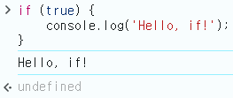
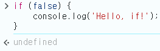
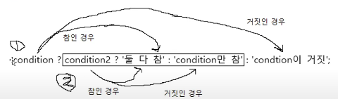
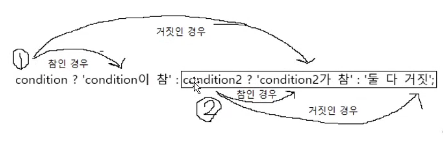

# 3. 조건문

## 1) 개념

- 조건문: 주어진 조건에 따라 코드를 실행하거나 실행하지 않는 문.
- `if` 조건문의 기본 형식

  ```js
  if (조건식) 동작문;
  ```

  `if` 뒤에 나오는 소괄호에 조건식을 넣고, 다음 줄에 동작문을 넣는다.

  - 동작문이 하나 이상이면 중괄호로 감싼다.
    ```js
    if (조건식) {
      동작문1;
      동작문2;
      동작문3;
    }
    ```
  - 조건식이 참인 값이면 내부의 동작문이 실행되고, 거짓인 값이면 동작문이 실행되지 않는다.

    

    

  - 조건식엔 꼭 true와 false만 오지 않음.
    ```js
    if (0) {
      console.log('Hello, if!');
    } //undefined -> 0은 불 값으로 형 변환하면 false.
    ```

## 2) if ~ else

두 방향으로 분기하기.

- 기본 형식
  ```js
  if (조건식) {
    동작문; //조건식이 참인 값일 때 실행
  } else {
    동작문; //조건식이 거짓인 값일 때 실행
  }
  ```
  eg.
  ```js
  if (false) {
    console.log('Hello, if!');
  } else {
    console.log('Hello, else!');
  } //Hello, else!
  ```
  <br>

## 3) if ~ else if ~ else

여러 방향으로 분기하기.

- 기본 형식
  ```js
  if (조건식) {
    동작문;
  } else if (조건식) {
    동작문;
  } else {
    동작문;
  }
  ```
- `else if`문 뒤에 `else`문이 반드시 나와야 하는 것은 아님.

- `else if`문은 `if`문과 `else`문 사이에 원하는 만큼 넣을 수 있음.

  eg. 점수에 따른 학점

  <코드>

  ```js
  const score = 90;
  if (score >= 90) {
    //90점 이상
    console.log('A+');
  } else if (score >= 80) {
    //80점 이상
    console.log('A');
  } else if (score >= 70) {
    //70점 이상
    console.log('B+');
  } else if (score >= 60) {
    //60점 이상
    console.log('B');
  } else {
    //60점 미만
    console.log('F');
  }
  ```

  <실행결과>

  ```
  A+
  ```

<br>

## 4) 중첩 if 조건문

eg.

<코드>

```js
let first = true;
let second = false;

if (first) {
  console.log('첫 번째 조건 충족!');
  if (second) {
    console.log('두 번째 조건도 충족!');
  } else {
    console.log('두 번째 조건은 불충족!');
  }
} else {
  console.log('첫 번재 조건 불충족!');
}
```

<실행결과>

```
첫 번째 조건 충족!
두 번재 조건은 불충족!
```

※ 중첩된 if문은 가독성을 위해 최대한 펴서 들여쓰기의 깊이를 최소화하는 것이 좋음.

따라서 위의 중첩 if문을 바꿔보면

```js
let first = true;
let second = false;

if (first && second) {
  //first와 second 모두 true
  console.log('첫 번째 조건 충족!');
  console.log('두 번째 조건도 충족!');
} else if (first) {
  //first 만 true
  console.log('첫 번째 조건 충족!');
  console.log('두 번째 조건은 불충족!');
} else {
  //둘 다 false
  console.log('첫 번째 조건 불충족!');
}
```

<br>

## 5) switch 조건문

`if`문을 좀 편하게 만든 것.

- 기본 형식

  ```js
  switch (조건식) {
    case 비교 조건식:
      동작문;
  }
  ```

  `switch`문에는 조건식 2개가 사용됨.

  `switch` 옆 소괄호 조건식의 값이 `case`의 비교 조건식 값과 일치(`===`)하면 해당 동작문이 실행됨.

  보통 조건식에 변수를 넣고, 비교 조건식에는 변수와 비교할 값을 넣음.

  eg.

  <코드>

  ```js
  let value = 'A';
  switch (value) {
    case 'A': //value와 'A'가 같으면 동작문 실행.
      console.log('A');
  }
  ```

  <실행결과>

  ```
  A
  ```

  <br>

- 동작문을 여러 개 돌 수도 있음. 이때 `if`문과 달리 중괄호는 필요하지 않음.

  <코드>

  ```js
  let value = 'A';
  switch (value) {
    case 'A':
      console.log('A');
      console.log('B');
  }
  ```

  <실행결과>

  ```
  A
  B
  ```

  <br>

- `if`문의 `else if`처럼 여러 방향으로 분기할 수도 있음. `case`를 여러 번 사용하면 됨.

  <코드>

  ```js
  let value = 'B';

  switch (value) {
    case 'A': //value가 'A'와 같으면
      console.log('A');
    case 'B': //value가 'B'와 같으면
      console.log('B');
    case 'C': //value가 'C'와 같으면
      console.log('C');
  }
  ```

  <실행결과>

  ```
  B
  C
  ```

  -> B만 출력될 것이라고 예상했겠지만, 실제로는 B와 C가 모두 출력됨.

<br>

- `switch`문은 일치하는 `case`를 발견하면 일치 여부와 상관없이 그 아래 `case`들의 동작문을 모두 실행함.

  따라서 원하는 결과만 얻으려면 수동으로 `case`에서 빠져나와야 함. 이때 `break`문이 사용됨.

  <코드>

  ```js
  let value = 'B';

  switch (value) {
    case 'A':
      console.log('A');
      break;
    case 'B':
      console.log('B');
      break;
    case 'C':
      console.log('C');
      break;
  }
  ```

  <실행결과>

  ```
  B
  ```

  <br>

- 어떠한 `case`에도 일치하지 않을 때 동작하는 `case`도 만들 수 있음. 이때는 `case` 대신 `default`라는 특수한 예약어 사용.

  <코드>

  ```js
  let value = 'F';

  switch (value) {
    case 'A':
      console.log('A');
      break;
    case 'B':
      console.log('B');
      break;
    case 'C':
      console.log('C');
      break;
    default;
    console.log('아무것도 일치하지 않음');
  }
  ```

  <실행결과>

  ```
  아무것도 일치하지 않음
  ```

  `default`에는 `break`문을 붙이지 않아도 됨. 제일 마지막 `case`라서 다음에 실행될 것이 없기 때문.

<br>

- `switch`와 `if`문의 차이점

  - 공통점: `case`는 `else if`, `default`는 `else`와 비슷. 실제로 `if`문이 `===` 연산자만 사용하는 경우 `switch`문으로 쉽게 대체 가능함.
  - 차이점: `else`는 `if`나 `else if` 뒤에만 나오지만, `default`는 어디에나 위치할 수 있음.

  `if`문과 `switch`문의 비교
  <코드>

  ```js
  let fruit = '사과';

  //if문
  if (fruit === '사과') {
    console.log('사과입니다!');
  } else if (fruit === '배') {
    console.log('배입니다!');
  } else if (fruit === '포도') {
    console.log('포도입니다!');
  } else {
    console.log('뭔지 모르겠습니다!');
  }

  //switch문
  switch (fruit) {
    default: //else 역할의 default가 맨 위에 있어도 됨.
      console.log('뭔지 모르겠습니다!');
      break;
    case '사과':
      console.log('사과입니다!');
      break;
    case '배':
      console.log('배입니다!');
      break;
    case '포도':
      console.log('포도입니다!');
      break;
  }
  ```

  <실행결과>

  ```
  사과입니다!
  사과입니다!
  ```

<br>

## 6) 조건부 연산자 사용하기

`if`문과 `switch`문 외에도 분기 처리에 사용하는 식을 **조건부 연산자** 또는 **삼항 연산자**라고 하는 연산자로 표현.

- 조건부 연산자의 기본 형식

  ```
  조건식 ? 참일 때 실행되는 식 : 거짓일 때 실행되는 식
  ```

  `?`와 `:`이 한 쌍.

- 조건부 연산자는 문이 아니라 식이기 때문에 결과값이 나옴.

  <코드>

  ```js
  5 > 0 ? '참입니다' : '거짓입니다';
  ```

  <실행결과>

  ```
  "참입니다"
  ```

  `5 > 0`은 `true`이므로 `"참입니다"`가 결과값으로 출력됨.

- 조건부 연산은 보통 조건에 따라 달라지는 값을 변수에 대입하기 위해 사용됨.

  <코드>

  ```js
  let value = 5 < 0 ? '참입니다' : '거짓입니다'; //undefined -> value 변수에 조건부 연산의 결과값을 대입.
  value; //"거짓입니다"
  ```

  <실행결과>

  ```
  "거짓입니다"
  ```

- 조건부 연산도 `if`문으로 변경 가능.

  <코드>

  ```js
  let condition = true;

  //조건부 연산
  let value = condition ? '참' : '거짓';
  console.log(value);

  //if문
  if (condition) {
    value = '참';
  } else {
    value = '거짓';
  }
  console.log(value);
  ```

  <실행결과>

  ```
  참
  참
  ```

  `if`문으로 길게 쓸 걸 조건부 연산으로 짧게 쓸 수 있음.

<br>

- 조건부 연산도 중첩해서 사용 가능.

  <코드> _첫 번째 조건(condition1)이 참인 경우_

  ```js
  let condition1 = true;
  let condition2 = false;

  let value = condition1
    ? condition2
      ? '둘 다 참'
      : 'condition1만 참'
    : 'condition1이 거짓';
  console.log(value);
  ```

  <실행결과>

  ```
  condition1만 참
  ```

  

  - 헷갈릴 땐 소괄호 사용

    ```js
    let value = condition1
      ? condition2
        ? '둘 다 참'
        : 'condition1만 참'
      : 'condition1이 거짓';
    ```

  - 또는 들여쓰기로 구분
    ```js
    let value = condition1
      ? condition2
        ? '둘 다 참'
        : 'condition1만 참'
      : 'condition1이 거짓';
    ```

- 첫 번째 조건(condition1)이 거짓인 경우

  <코드>

  ```js
  let condition1 = false;
  let condition1 = true;

  let value = condition1
    ? 'condition1이 참'
    : condition2
    ? 'condition2가 참'
    : '둘 다 거짓';
  ```

  

  - 헷갈릴 땐 소괄호 사용

    ```js
    let value = condition1
      ? 'condition1이 참'
      : condition2
      ? 'condition2가 참'
      : '둘 다 거짓';
    ```

    소괄호로 묶인 게 조건1에 대한 '거짓일 때 실행되는 식'.

<br>
※ Quiz

다음 `if`문을 `switch`문과 조건부 연산자로 바꿔보세요.

```js
let cond = true;
let value = '';

if (cond) {
  value = '참';
} else {
  value = '거짓';
}
```

<br>

- `switch`문으로 바꾸면

  ```js
  let cond = true;
  let value = '';

  switch (cond) {
    case true:
      value = '참';
      break;
    case false:
      value = '거짓';
      break;
  }
  ```

<br>

- 조건부 연산자으로 바꾸면

  ```js
  let cond = true;
  let value = cond ? '참' : '거짓';
  ```
