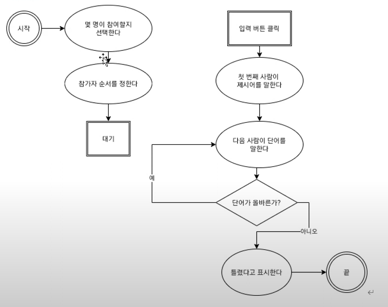

# 들어가기에 앞서

<br>

## 흔히 발생하는 에러

- Uncaught **ReferenceError**: consle is not defined.

  : 'console' 입력 시 오타가 있을 때 나타나는 에러.

  ```
  consle.log('Hello World')
  ```

  <br>

- Uncaught **TypeError**: console.lg is not a function.

  : 기능 이름에 오타가 있을 때 나타나는 에러.

  ```
  console.lg('Hello World')
  ```

  <br>

- Uncaught **SyntaxError**: missing ) after argument list.

  : 괄호를 빼먹었을 때 나타나는 에러.

  ```
  console.log('Hello World'
  ```

  <br>

- Uncaught **SyntaxError**: Invalid or unexpected token.

  : 규칙에 따라 나와야 하는 요소가 나오지 않았을 때 나타나는 에러.

  ```
  console.log('Hello World)
  ```

  -> 따옴표의 짝을 맞추지 않았음.
  <br>
  <br>
  <br>

## 코드 실행 방식

1. 인터프리터(interpreter): 코드를 한 줄씩 바로바로 실행하는 방식.
   <br> eg. console에서 바로 실행.
   <br> JavaScript는 인터프리터 방식으로, 코드를 한 줄씩 읽는다.
   <br>

2. 컴파일(compile): 코드를 컴퓨터가 이해할 수 있는 언어로 변환하는 과정을 거친 후 한 번에 실행하는 방식.
   <br> C, C++, 자바 등의 언어에서 사용하는 방식이다.

<br>
<br>
<br>

## 순서도

> 프로그램이 수행하는 명령에 대한 순서와 절차를 시각적으로 표현해 알아보기 쉽게 함.
> <br>
> 순서도를 작성하고, 순서도를 그대로 코드로 옮기면 프로그램이 의도한 동작을 수행.
> 수학 문제의 공식. 알고리즘 풀 때 순서도 공식을 가지고 문제 품.

※ 순서도를 그리는 방식은 워낙 다양해서 공식이 존재하지 않음. 사람마다 다르게 그림.

순서도 예시:



| 유형                                                                 | 표현            |
| -------------------------------------------------------------------- | --------------- |
| 시작, 끝                                                             | 줄 2개의 원형   |
| 각 절차                                                              | 타원            |
| 흐름                                                                 | 화살표          |
| 특수한 이벤트 <br> eg. 대기 (사용자가 값 입력, 버튼 누름, 몇초 대기) | 줄 2개의 사각형 |
| 판단 (예/아니오) <br> aka 분기점, 조건                               | 마름모          |
